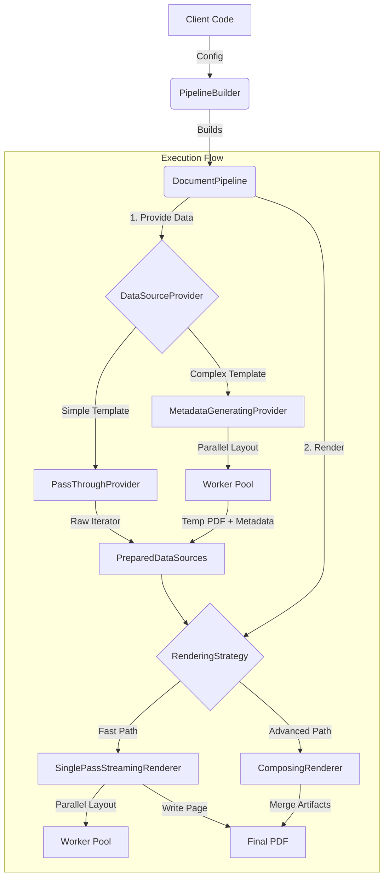

# Software Architecture Specification: `petty::pipeline` Module

## 1. Executive Summary

The `petty::pipeline` module constitutes the high-level orchestration layer of the document generation engine. Its primary responsibility is to bind the `parser`, `core::layout`, and `render` modules into a cohesive, high-performance execution unit.

This module implements a **concurrent, multi-stage pipeline architecture** designed to balance low latency with advanced feature support. It employs the **Strategy Pattern** to dynamically select between two distinct generation paths based on template complexity:
1.  **Fast Path (Streaming):** For simple documents, data is streamed directly through layout to PDF output with minimal memory overhead.
2.  **Advanced Path (Two-Pass):** For documents requiring forward references (e.g., Table of Contents, Index, "Page X of Y"), the pipeline performs a full analysis pass to generate metadata before composing the final document.

Key architectural goals include thread-safe resource sharing via `PipelineContext`, efficient parallel layout calculation using a worker pool, and a fluent builder API for configuration.

## 2. System Architecture

The module is organized into four logical layers that transform raw data and templates into a final PDF.

1.  **Configuration Layer (`PipelineBuilder`)**:
  *   Responsible for loading templates, discovering fonts, and configuring cache settings.
  *   Performs static analysis on the template to automatically select the appropriate execution strategy (`Auto` generation mode).

2.  **Orchestration Layer (`DocumentPipeline`)**:
  *   Acts as the facade for the execution.
  *   Manages the lifecycle of the generation process, creating the shared `PipelineContext`.
  *   Delegates work to the configured `DataSourceProvider` and `RenderingStrategy`.

3.  **Data Preparation Layer (`provider/`)**:
  *   **Input:** Iterator of JSON data (`Value`).
  *   **Responsibility:** Prepares the data for rendering.
  *   **Strategies:**
    *   *Pass-Through:* Wraps the iterator directly (Zero-cost).
    *   *Metadata Generating:* Consumes the iterator, runs a layout pass to a temporary file, collects global metadata (page numbers, anchors), and produces a `PreparedDataSources` object containing the metadata and the temporary artifact.

4.  **Rendering & Execution Layer (`renderer/`, `worker.rs`, `concurrency.rs`)**:
  *   **Input:** `PreparedDataSources`.
  *   **Responsibility:** Manages the worker thread pool for layout calculation and serializes the result to the output writer.
  *   **Strategies:**
    *   *Streaming:* Consumes layout results immediately and writes PDF pages.
    *   *Composing:* Merges a pre-rendered body (from the temporary file) with newly generated content (like prefaces or ToCs) based on the collected metadata.

### Data Flow Diagram



## 3. Core Abstractions & Data Models

### Key Traits

*   **`DataSourceProvider` (`provider/mod.rs`)**
  *   **Contract:** `fn provide(...) -> Result<PreparedDataSources, PipelineError>`
  *   **Role:** Abstraction for the "Analysis Pass." It determines whether the data needs to be fully processed to generate metadata before the final render begins.

*   **`RenderingStrategy` (`renderer/mod.rs`)**
  *   **Contract:** `fn render(...) -> Result<W, PipelineError>`
  *   **Role:** Abstraction for the "Final Pass." It defines how the processed data and optional metadata are turned into a bytestream.

### Key Structs

*   **`PipelineContext` (`context.rs`)**
  *   **Role:** A thread-safe, reference-counted container for read-only resources required by all workers.
  *   **Contents:** `CompiledTemplate`, `SharedFontLibrary`, `PipelineCacheConfig`.

*   **`PreparedDataSources` (`api.rs`)**
  *   **Role:** The handover object between the Provider and Renderer.
  *   **Contents:**
    *   `data_iterator`: The data to be rendered (may be empty if already consumed).
    *   `document`: Optional `Arc<Document>` containing global metadata (ToC, Anchors).
    *   `body_artifact`: Optional `Box<dyn ReadSeekSend>` pointing to a temporary file containing the pre-rendered body.

*   **`Document` (`api.rs`)**
  *   **Role:** The serializable public API representing the structure of the generated document.
  *   **Contents:** `page_count`, `headings` (for ToC), `anchors` (for links), `figures`.

## 4. Subsystem Analysis

### 4.1. Concurrency Subsystem
**Files:** `concurrency.rs`, `worker.rs`
*   **Responsibility:** Implements the parallel processing model.
*   **Mechanism:**
  1.  **Producer Task:** Iterates over input data and sends generic JSON items to a bounded channel.
  2.  **Worker Pool:** A set of threads (scaled to CPU count) that receive JSON items, execute the `LayoutEngine` (from `core::layout`), and produce `LaidOutSequence` objects.
  3.  **Ordered Consumer:** A critical component ensuring that while layout happens in parallel (potentially out-of-order), pages are written to the PDF in the strict order of the input data.
*   **`worker.rs`:** Bridges the gap between the raw `LayoutEngine` and the pipeline. It handles resource loading (images) and ID generation for headings.

### 4.2. Provider Subsystem
**Files:** `provider/metadata.rs`, `provider/passthrough.rs`
*   **`PassThroughProvider`:** A no-op provider. It forwards the user's data iterator directly. Used when the template requires no global knowledge.
*   **`MetadataGeneratingProvider`:**
  *   Spins up the concurrency machinery (`producer`, `workers`, `consumer`) internally.
  *   Directs the consumer to write the results to a `tempfile`.
  *   Simultaneously builds a `Pass1Result` (accumulating page counts, anchor locations, and ToC entries).
  *   Returns the temp file and the constructed `Document` metadata.

### 4.3. Renderer Subsystem
**Files:** `renderer/streaming.rs`, `renderer/composing.rs`
*   **`SinglePassStreamingRenderer`:**
  *   Spins up the concurrency machinery.
  *   Directs the consumer to write directly to the user's output `Writer`.
  *   Ignores any pre-calculated metadata (assumes Fast Path).
*   **`ComposingRenderer`:**
  *   **Concept:** PDF manipulation and merging.
  *   **Process:**
    1.  Loads the "Body Artifact" (temp PDF) via `lopdf`.
    2.  Executes "Prepend" role templates (e.g., Cover Page, Table of Contents) using the collected `Document` metadata as the data source.
    3.  Executes "Append" role templates (e.g., Index, Back Cover).
    4.  Executes "Overlay" role templates (e.g., Headers/Footers) onto every page.
    5.  **Fixup:** Rewrites internal PDF link annotations because page indices shift when content is prepended. Generates the PDF "Outlines" dictionary (Bookmarks).

## 5. API Specification

### `PipelineBuilder`
The primary entry point for consumers.

```rust
// Configuration
pub fn new() -> Self;
pub fn with_template_file<P: AsRef<Path>>(self, path: P) -> Result<Self, PipelineError>;
pub fn with_template_source(self, source: &str, extension: &str) -> Result<Self, PipelineError>;

// Resources
pub fn with_system_fonts(self, system_fonts: bool) -> Self;
pub fn with_font_dir<P: AsRef<Path>>(self, path: P) -> Self;

// Tuning
pub fn with_generation_mode(self, mode: GenerationMode) -> Self; // Auto vs ForceStreaming
pub fn with_pdf_backend(self, backend: PdfBackend) -> Self;

// Finalization
pub fn build(self) -> Result<DocumentPipeline, PipelineError>;
```

### `DocumentPipeline`
The executable artifact.

```rust
// Streaming Generation (Async)
pub async fn generate<W, I>(&self, data: I, writer: W) -> Result<W, PipelineError>
where 
    W: Write + Seek + Send + 'static,
    I: Iterator<Item = Value> + Send + 'static;

// Convenience File Generation (Blocking wrapper)
pub fn generate_to_file<P, I>(&self, data: I, path: P) -> Result<(), PipelineError>;
```

### `Document` (Metadata API)
The structure available to templates (e.g., inside a `{{#each headings}}` loop in a ToC template).

```rust
pub struct Document {
    pub page_count: usize,
    pub headings: Vec<Heading>, // { id, level, text, page_number }
    pub anchors: Vec<Anchor>,   // { id, page_number, y_position }
    pub index_entries: Vec<IndexEntry>,
    // ...
}
```

## 6. Feature Specification

*   **Automatic Strategy Selection:** The pipeline analyzes the template features (flags like `uses_index_function`, `has_table_of_contents`) to automatically choose the most efficient rendering path (Streaming vs. Composing).
*   **Role-Based Templating:** Supports specialized sub-templates ("roles") like `cover-page`, `table-of-contents`, `page-header`, and `page-footer`. These are rendered separately and composited into the final document.
*   **Parallel Layout:** Utilizes a scalable thread pool to perform heavy text shaping and layout calculations, significantly speeding up large batch processing.
*   **Memory Management:**
  *   Uses `tempfile` for intermediate storage during multi-pass generation to prevent unbounded memory usage.
  *   Implements generic `Iterator` support, allowing datasets larger than available RAM to be processed.
*   **PDF Post-Processing:** The `ComposingRenderer` handles complex PDF tasks such as:
  *   Merging multiple PDF documents.
  *   Overlaying content (watermarks, page numbers) on existing pages.
  *   Generating the PDF Navigation pane (Outlines).
  *   Resolving internal hyperlinks (`GoTo` actions) across document sections.

## 7. Error Handling Strategy

The module utilizes the `PipelineError` enum to encapsulate failures from various stages.

*   **Error Propagation:** Errors in worker threads (layout calculation) are captured and sent through the channel to the consumer, which then aborts the pipeline and propagates the result to the main thread.
*   **Resource Cleanup:** Uses `tokio` tasks. If an error occurs, the orchestrator explicitly aborts the producer and worker tasks to prevent zombie processes.
*   **Types:**
  *   `PipelineError::Io`: File access failures (templates, fonts, output).
  *   `PipelineError::Layout`: Errors originating from the core layout engine (e.g., content too large for page).
  *   `PipelineError::Config`: Invalid builder configurations or template syntax errors.